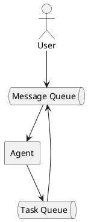

# Asynchronous user input

The current behaviour of the code blocks the user from entering new messages while
the AI agent or a Tool is still working. We call the AI-agent + Tools processing
cycle the `Turn-Loop` — the function that handles one user input and returns a
result. In the code we also rename the `handle` method to `turnLoop`.

As you might guess, to make this asynchronous we need to run the `turnLoop` logic
in a separate coroutine, so it doesn't block user input. But what do we do with the
input itself?

If we wanted to build a modern agent client, we'd want true, full asynchrony. For
that we'd move every component into its own coroutine and connect them through
channels:



This design is maximally flexible, but the AI-agent API we chose requires us to
return the results of all Tools synchronously. A small digression is in order here.
Modern `API`s, such as `Anthropic`'s, let you work with the agent in an `EventDriven`
model (the SSE protocol) and are perfect for interactive applications. But for a
typical Claw-style application an `EventDriven` API is overkill.

Let's start the refactoring by transforming the `Turn-Loop` logic:
1. Extract the code that handles one Turn into a separate `startTurn` method.
2. Rename the old `handle` method to `turnLoop`.

Now we can modify the main loop:
```php
$deferredMessages = [];
$currentTurn = null;

while (($message = $this->conversation->receive()) !== null) {
    $deferredMessages[] = $message;

    if ($currentTurn === null || $currentTurn->isCompleted()) {
        $currentTurn = spawn($this->startTurn(...), $deferredMessages);
        $deferredMessages = [];
    }
}
```

The idea is that the main loop runs independently of the `Turn-Loop` and accumulates
all user messages into an array. As soon as the `Turn-Loop` finishes, we start a new
`Turn-Loop` with the accumulated messages. Only one `Turn-Loop` runs at a time, while
the code handling incoming messages is never blocked.

Looks good, but unfortunately it doesn't work the way we need: if the user has already
sent `$deferredMessages`, we're waiting on `$this->conversation->receive`, and the
`$currentTurn` coroutine has finished, then there is no one left to push
`$deferredMessages` into a new `Turn-Loop`!

We need to separate the message-queue handling from the `Turn-Loop` logic so they
work independently, yet stay connected by something. In essence we need a sequence
of `Turn-Loop`s that processes incoming messages.

```php
private function turnsMainLoop(): void
{
    for (;;) {
        // Wait for an incoming message...
        $batch = $this->deferredMessages;
        $this->deferredMessages = [];
        $this->startTurn($batch);
    }
}
```

But how do we wait for incoming messages? The `Channel` primitive is a perfect fit.
A `Channel` can serve both as a message queue and as the anchor the `Turn-Loop` waits
on!

Let's set up an `inbox` channel of messages:

```php
// Use a buffered channel
$this->inbox = new Channel(16);
$turns = spawn($this->turnsMainLoop(...));

while (($message = $this->conversation->receive()) !== null) {
    $this->inbox->send($message);
    $this->conversation->showDeferred($message);  // show it queued (dim) until a turn takes it
}
```

Now let's write `turnsMainLoop`, which will drive the many separate turn cycles:
```php
while (true) {
    try {
        $batch = [$this->inbox->recv()];
    } catch (ChannelException) {
        return;   // channel closed and drained: the chat is over
    }

    while (!$this->inbox->isEmpty()) {
        $batch[] = $this->inbox->recv();
    }

    $this->conversation->flushDeferred();
    $this->startTurn($batch);
}
```

Let's also improve `ConversationInterface` so it can show, in the history, the
messages that have been sent but not yet processed.

Finally we can admire the result! While the AI agent is thinking, the user can send
new messages, which are displayed in grey. After a successful reply, the agent
immediately picks up the whole chat.

It would also be nice to add the ability to cancel the `Turn-Loop` if the user
changes their mind — for example, by pressing "ESC" or sending the `/stop` command.

For example:
```php
if ($message === '/stop') {
    $this->currentTurn?->cancel();
    continue;
}
```

> Note!
> To capture `ESC` you'd have to put the terminal into raw mode and read input byte
> by byte, which would require rewriting the code and adapting it to different
> operating systems.

## Cancelling operations

`TrueAsync` supports cancelling any coroutine via the `Coroutine::cancel()` method:

```php
    if($message === '/stop' && $currentTurn !== null && $currentTurn->isRunning()) {
        $currentTurn->cancel(new \Async\AsyncCancellation('User canceled'));
    }
```

The `AsyncCancellation` exception can carry a cancellation reason, and it is delivered
to the coroutine's last suspension point. Here we need to talk more seriously about
how coroutines actually work in `TrueAsync` and how they pass control around.

## TrueAsync coroutines and suspend

Coroutines in `TrueAsync` always yield control cooperatively. You cannot take control
away from a coroutine — as happens, say, in `Go` — or interrupt it at an arbitrary
point. When a coroutine wants to yield control it calls the `suspend()` function. From
that moment the coroutine doesn't know when control will return to it. It also doesn't
and cannot know where exactly control will be passed.

```php
use function Async\spawn;
use function Async\suspend;

function a(): void
{
    echo "a: before suspend\n";
    suspend();
    echo "a: after suspend\n";
}

function b(): void
{
    echo "b: before suspend\n";
    suspend();
    echo "b: after suspend\n";
}

spawn(a(...));
spawn(b(...));
```

This prints (assuming there are no other coroutines):
```bash
a: before suspend
b: before suspend
a: after suspend
b: after suspend
```

The `suspend` function passes control to another coroutine and, as a result, may throw
an exception. This is exactly how the cancellation mechanism works:


```php
use function Async\spawn;
use function Async\suspend;
use Async\AsyncCancellation;
use Async\Coroutine;

function a(): void
{
    echo "a: before suspend\n";
    suspend();
    echo "a: never executed\n";
}

function b(Coroutine $coroutine): void
{
    echo "b: before suspend\n";
    $coroutine->cancel();
    suspend();
    echo "b: after suspend\n";
}

$coroutine = spawn(a(...));
spawn(b(...), $coroutine);
```

This time the output is:
```bash
a: before suspend
b: before suspend
b: after suspend
```

The line `echo "a: never executed\n";` never gets control. Here is what happened:
1. The `suspend()` function threw an `AsyncCancellation` exception.
2. The exception was caught at the completion point of coroutine `a()`.

And here is the important fact: the `suspend()` function is most often called not
explicitly from PHP code, but from other I/O functions! In other words:
```php
function a(): void
{
    echo "before suspend\n";
    file_get_contents('http://example.com'); 
    echo "after\n";
}
```

The PHP standard-library function `file_get_contents` calls `suspend` under the hood,
and at that moment control is passed to another coroutine. So what happens if we
trigger a cancellation during the `file_get_contents` operation? The operation will be
aborted. `file_get_contents` will see the cancellation exception, handle it, and
return `false`.

This approach lets us add concurrent execution to every I/O library function with
minimal changes on the PHP developer's side. In most cases you won't need to modify
your code specifically to use cancellation or asynchrony. However, it is important to
understand at which points the switching happens and how exactly the library functions
react to it.

The simplest way to implement cancellation of the current `Turn-Loop`:
1. Run the `Turn-Loop` in a separate coroutine
2. Explicitly cancel it when the `/stop` command is typed

## Connecting Telegram

Once the core code is debugged and working, we can add a driver for a Telegram bot.
Why a Telegram bot? It has the simplest possible API, which is easy to implement on
top of CURL.

Setup steps:
1. create a bot via `@BotFather` and obtain a token.
2. Then find out your Telegram user id (for example, via `@userinfobot`) and set three
   environment variables:

```bash
CLAW_CHANNEL=telegram
TELEGRAM_BOT_TOKEN=123456:ABC-DEF...
CLAW_ALLOWED_CHATS=11111111,22222222   # who is allowed to use the bot
```

`CLAW_ALLOWED_CHATS` is the security guarantee. This way only those users — or trusted
people — can interact with the bot.

## Extra features included in the release

This release also includes other changes:
1. SQLite for storing chat history
2. A security layer that can assess how dangerous an operation is

Full release code: https://github.com/true-async/php-claw/releases/tag/async-ui
