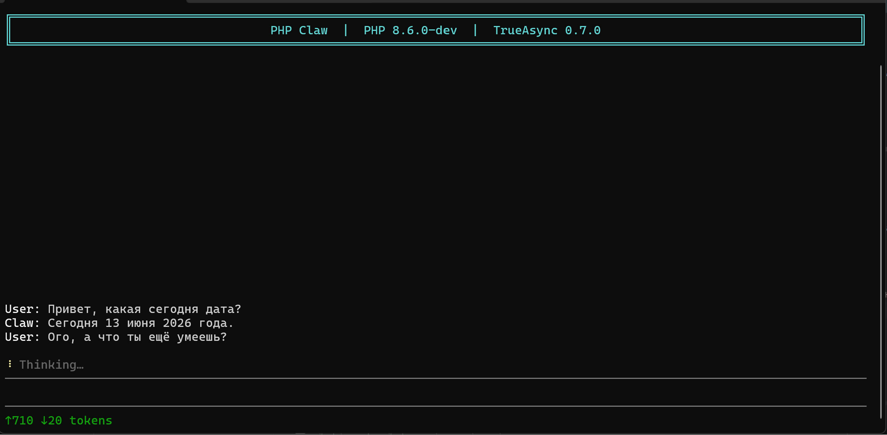

# Асинхронность

В коде https://github.com/true-async/php-claw/releases/tag/sync нет никакой асинхронности.
Например, если AI-агент запустит какой-то длительный Tool, то пока он не закончит выполняться, 
агент не сможет ничего делать, даже отвечать пользователю. Это не совсем то, что мы хотим от нашего агента.
Мы хотим, чтобы агент мог запускать несколько инструментов одновременно, 
и при этом не блокировать себя, а продолжать общаться с пользователем.

Для этого нам нужно сделать код **асинхронным**. 
Сейчас главный цикл приложения выглядит так:
```php
    public function run(): void
    {
        while (($text = $this->conversation->receive()) !== null) {
            // A failure ends this task, not the conversation. React by cause.
            try {
                $this->handle($text);
            } catch (ContextLengthException $e) {
                
            }
        }
    }
```

А внутри `handle()` есть ещё два цикла. Малый цикл по всем Tool, и большой цикл.
```php
            $results = [];
            foreach ($response->toolCalls as $call) {
                $results[] = $this->execute($call);
            }
```

Наиболее простой способ добавить асинхронность, вызывать метод `run` в отдельной корутине. Тогда приложение
сможет обрабатывать множество разных чатов. 

Ещё можно выполнить `$this->execute($call)` в корутине:

```php
            $results = [];
            foreach ($response->toolCalls as $call) {
                $results[] = spawn($this->execute(...), $call);
            }

            $results = await_all($results);
```

Тогда каждый Tool станет асинхронным, и если он запускает что-то через `shell` или использует функции ввода вывода, 
операции будут идти конкурентно и в сумме занимать меньше времени.

Обратите внимание, нам не пришлось переписывать код Tool.
Изменился лишь способ вызова и получения результата. Это удобство 
прозрачной модели асинхронности, где любая функция в любой момент может быть вызвана асинхронно.

API `spawn` запускает метод `execute` в отдельной корутине с параметром `$call` и возвращает объект корутины. 
API `await_all` позволяет дождаться список корутин. `await_all` возвращает соответствующий массив результатов в том же порядке, 
в каком корутины находились в массиве.

## Асинхронная консоль

Чтобы продолжать дальше добавлять асинхронность, нам нужно что-то, что визуально покажет результат. 
Даже если всё приложение станет на 100% асинхронным, это не получится увидеть, если консоль будет синхронной.
Поэтому нам нужно использовать совершенно другой режим консоли, особенный режим, позволяющий выводить
текст и символы в разных местах экрана. Показать отдельно поле ввода, 
поле истории и статусную строку.

Например, так:
```bash
User: Hello, AI!
---------------------------------------
User: ...
---------------------------------------
Status: processing...
```

Чтобы добиться эффекта отдельных зон-компонентов (баннер, статус, ввод, панель токенов, история),
будем использовать управляющие последовательности и обычный cooked-режим терминала.

Управляющие коды позволяют полностью контролировать работу консоли.

| Код                       | Действие                                                                  |
|---------------------------|---------------------------------------------------------------------------|
| `\033[{r};{c}H`           | поставить курсор в строку `r`, колонку `c`                                |
| `\033[2K` / `\033[2J`     | очистить строку / экран                                                   |
| `\033[s` / `\033[u`       | сохранить / восстановить позицию курсора (пишем в статус, не сбивая ввод) |
| `\033[?25l` / `\033[?25h` | спрятать / показать курсор на время перерисовки                           |
| `\033[…m`                 | цвета (SGR)                                                               |

Включать обработку этих кодов (VT-режим) специально не нужно, в современных терминалах она уже активна.
Остаётся использовать `fwrite(STDOUT)` и `fgets(STDIN)` для чтения и записи.

Результирующий интерфейс будет выглядеть примерно так:


Синхронная природа интерфейса сразу бросается в глаза: поле ввода блокируется, пока агент обрабатывает запрос.
Чтобы решить эту проблему, нужно считывать поток ввода независимо от рендеринга остальных компонентов. 
Как этого добиться?
Создадим отдельную функцию `readLoop`, задача которой будет считывание ввода пользователя.

```php
    private function readLoop(): void
    {
        while (true) {
            fwrite(STDOUT, "\033[{$this->inputRow};1H\033[2K");
            fflush(STDOUT);
            $line = fgets(STDIN);

            if ($line === false) {
                $this->eof = true;   // EOF (Ctrl-D / closed stdin)
                return;
            }

            $line = trim($line);

            if ($line === '') {
                continue;
            }

            // Re-assert the scroll region + separators (the Enter newline may
            // nudge them), record the line, then re-home the cursor.

            fwrite(
                STDOUT,
                "\033[{$this->chatStart};{$this->chatRows}r"
                . "\033[{$this->sepTopRow};1H\033[2K" . self::C_SEP . $this->sep . self::C_RESET
                . "\033[{$this->sepBotRow};1H\033[2K" . self::C_SEP . $this->sep . self::C_RESET
                . "\033[{$this->inputRow};1H\033[2K"
            );
            
            $this->appendChat(self::C_USER . 'User: ' . self::C_RESET . $line . "\n");
            $this->inbox[] = $line;
        }
    }
```

Чтобы работа функции не блокировала основной поток приложения, запустим её в отдельной корутине, 
которую инициализируем в конструкторе драйвера консоли:

```php
$this->reader = spawn($this->readLoop(...));
```

Алгоритм функции `readLoop`:
1. Устанавливает позицию курсора на вычисленную строку ввода
2. Ожидает ввода `fgets(STDIN)`
3. Записывает результат в массив `inbox`
4. Обновляет интерфейс, перерисовывая разделительные линии и прокручивая чат.

Теперь области интерфейса работают независимо друг от друга.
Эффект достигается благодаря тому, что `TrueAsync` влияет на всю подсистему ввода вывода. 
Вызов функции `fgets(STDIN)` останавливает выполнение корутины `readLoop`, а не блокирует весь PHP-процесс. 
Когда же пользователь вводит новые данные, корутина возобновляется.

Операция добавление строк в массив абсолютно безопасна, потому что действия происходят в одном процессе, 
и гонки данных не возникает.
```php
$this->inbox[] = $line;
```

Попросим агента добавить в `AsyncConsoleConversation` код обновления размеров окна, небольшую адаптацию для `Windows` 
и консоль готова!