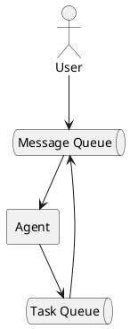

# Асинхронный пользовательский ввод

Текущее поведение кода ограничивает пользовательский ввод новых предложений, 
пока Ai-агент или Tools находится в процессе. Цикл обработки AI-агент + Tools называется `Turn-Loop`.
Будем использовать этот термин, чтобы обозначить функцию, которая обрабатывает один пользовательский ввод и возвращает результат.
В коде так же изменим метод handler на `turnLoop`.

Как можно догадатся, чтобы достичь асинхронного поведения, нужно запустить логику `turnLoop` в отдельной корутине,
тогда она не будет блокировать пользовательский ввод. Но что делать с пользовательским вводом?!

Если бы мы хотели построить современный агентский клиент, 
нам бы захотелось обеспечить настоящую и полную асинхронность.
Для этого нужно было бы каждый компонент вынести в отдельную корутину, 
а взаимодействие вынести в каналы:



Данная схема максимально гибкая, однако выбранный API AI-агентов требует, 
чтобы мы вернули результат всех Tools синхронно. Здесь стоит сделать небольшое отступление.
Современные `API`, например такие, как в `Anthropic` позволяют работать с агентом по модели `EventDriven` (SSE протокол) и идеально 
подходят для интерактивных приложений. Но для Claw-типичного приложения `EventDriven` API избыточен.

Начнём рефакторинг с трансформации логики `Turn-Loop`:
1. Выделим код обработки одного Turn в отдельный метод `startTurn`.
2. А старый метод `handle` переименуем в `turnLoop`.

Теперь можно модифицировать главный цикл:
```php
$deferredMessages = [];
$currentTurn = null;

while (($message = $this->conversation->receive()) !== null) {
    $deferredMessages[] = $message;

    if ($currentTurn === null || $currentTurn->isCompleted()) {
        $currentTurn = spawn($this->startTurn(...), $deferredMessages);
        $deferredMessages = [];
    }
}
```

Идея в том, что главный цикл крутится независимо от работы `Turn-Loop`,
и накапливает все сообщения пользователя в массив. Как только `Turn-Loop` завершает работу,
мы запускаем новый `Turn-Loop` с накопленными сообщениями. Одновременно только один `Turn-Loop` может работать,
вместе с тем код обработки входящих сообщений не заблокирован. 

Выглядит неплохо, но увы не работает как нужно: если пользователь уже отправил `$deferredMessages`, 
мы ожидаем `$this->conversation->receive`, а корутина `$currentTurn` завершилась, то нет никого, 
кто пошлёт `$deferredMessages` в новый `Turn-Loop`!

Нужно отделить обработку очереди сообщений от `Turn-Loop` логики так, чтобы они работали независимо, 
но при этом были связаны чем-то. 
По сути нужна последовательность `Turn-Loop`ов, которая будет обрабатывать входящие сообщения.

```php
private function turnsMainLoop(): void
{
    for (;;) {
        // Ждать входящего сообщения...
        $batch = $this->deferredMessages;
        $this->deferredMessages = [];
        $this->startTurn($batch);
    }
}
```

Но как организовать ожидание входящих сообщений? Для этого идеально подойдёт примитив `Channel`.
`Channel` может служить и очередью для сообщений, и якорем для `Turn-Loop`, 
для ожидания!

Организуем канал из сообщений `inbox`:

```php
// Используем буферизированный канал
$this->inbox = new Channel(16);
$turns = spawn($this->turnsMainLoop(...));

while (($message = $this->conversation->receive()) !== null) {
    $this->inbox->send($message);
    $this->conversation->showDeferred($message);  // show it queued (dim) until a turn takes it
}
```

Теперь оформим `turnsMainLoop`, который будет управлять множеством разных turn-циклов:
```php
while (true) {
    try {
        $batch = [$this->inbox->recv()];
    } catch (ChannelException) {
        return;   // channel closed and drained: the chat is over
    }

    while (!$this->inbox->isEmpty()) {
        $batch[] = $this->inbox->recv();
    }

    $this->conversation->flushDeferred();
    $this->startTurn($batch);
}
```

Усовершенствуем `ConversationInterface` чтобы он позволил 
отображать в истории сообщения, которые отправлены, но ещё не обработаны.

Наконец можно полюбоваться на результат!
Пока AI-агент думает, пользователь может отправлять новые сообщения, 
которые отображаются серым цветом. После успешного ответа, агент сразу же подхватывает весь чат.

Хорошо бы так же добавить возможность отмены `Turn-Loop`, 
если пользователь передумал. Например, при нажатии на кнопку "ESC" или отправке команды `/stop`.

Например:
```php
if ($message === '/stop') {
    $this->currentTurn?->cancel();
    continue;
}
```

> Примечание!
> Чтобы ловить `ESC`, придётся перевести терминал в raw-режим и читать ввод побайтово, что потребует 
> переписывания кода и адаптация его под разные операционные системы.

## Отмена операций

`TrueAsync` поддерживает возможность отменить любую корутину через метод `Coroutine::cancel()`:

```php
    if($message === '/stop' && $currentTurn !== null && $currentTurn->isRunning()) {
        $currentTurn->cancel(new \Async\AsyncCancellation('User canceled'));
    }
```

Исключение `AsyncCancellation` может содержать причину отмены, и будет передано в точку последней приостановки корутины.
Здесь необходимо более серьёзно поговорить о том, как именно работают корутины в `TrueAsync` и как они передают управление.

## Корутины TrueAsync и suspend

Корутины в `TrueAsync` всегда передают управление кооперативно. У корутины нельзя забрать управление,
как например это происходит в `Go` или прервать её в каком угодно месте.
Когда корутина хочет передать управление она зовёт `suspend()` функцию. С этого момента корутина не знает,
в какой момент времени к ней вернётся управление. Она так же не знает и не может знать, куда именно управление будет передано.

```php
use function Async\spawn;
use function Async\suspend;

function a(): void
{
    echo "a: before suspend\n";
    suspend();
    echo "a: after suspend\n";
}

function b(): void
{
    echo "b: before suspend\n";
    suspend();
    echo "b: after suspend\n";
}

spawn(a(...));
spawn(b(...));
```

Будет выведено (при условии, что никаких других корутин нет):
```bash
a: before suspend
b: before suspend
a: after suspend
b: after suspend
```

Функция `suspend` передаёт управление в другую корутины, а как результат может выбросить исключение. 
Именно так и работает механизм отмены:


```php
use function Async\spawn;
use function Async\suspend;
use Async\AsyncCancellation;
use Async\Coroutine;

function a(): void
{
    echo "a: before suspend\n";
    suspend();
    echo "a: never executed\n";
}

function b(Coroutine $coroutine): void
{
    echo "b: before suspend\n";
    $coroutine->cancel();
    suspend();
    echo "b: after suspend\n";
}

$coroutine = spawn(a(...));
spawn(b(...), $coroutine);
```

На этот раз вывод будет таким:
```bash
a: before suspend
b: before suspend
b: after suspend
```

Код `echo "a: never executed\n";` никогда не получит управление. Произошло следующее:
1. Функция `suspend()` выбросила исключение `AsyncCancellation`
2. Исключение было перехвачено в точке завершения корутины `a()`.

И вот важный факт: функция `suspend()` чаще всего вызыается не из PHP-кода явно, а из других функций ввода вывода!
Иначе говоря:
```php
function a(): void
{
    echo "before suspend\n";
    file_get_contents('http://example.com'); 
    echo "after\n";
}
```

Функция стандартной библиотеки PHP `file_get_contents` под копотом сама вызовит `suspend`, 
и в этот момент управление будет передано другой корутине. Что же произойдёт, если во время операции `file_get_contents`
инициировать отмену? Операция будет прервана. `file_get_contents` увидит исключение отмены, обработает его и вернёт `false`.

Данный подход позволяет добавить конкурентное исполнение в каждую библиотечную функцию ввода вывода с минимальными 
изменениями со стороны PHP-разработчика. В большинстве случаев не придётся специально модифицировать код, 
чтобы использовать отмену или асинхронность. Однако важно понимать, в каких точках происходит переключение 
и как именно функции библиотеки реагируют на него.

Самый простой способ реализовать отмену текущего `Turn-Loop`:
1. Запустить `Turn-Loop` в отдельной корутине
2. Явно отменить её при наборе команды `/stop`

## Подключение Telegram

До сих пор единственным каналом общения был терминал. Но `Session` и `Turn-Loop`
не знают, откуда приходят сообщения и куда уходят ответы — они общаются только
через абстракции `ChatInterface` (входящие «соединения») и `ConversationInterface`
(один диалог: `receive` / `send` / `confirm` / `updateStatus`). Значит, чтобы
агент заговорил в Telegram, достаточно реализовать эти два интерфейса — сам агент,
`Turn-Loop` и инструменты менять не нужно.

### Бот, а не пользователь

Telegram даёт два пути: клиент пользователя (протокол `MTProto`, привязка к номеру
телефона) и **Bot API** (обычный HTTPS, токен от `@BotFather`). Claw использует
Bot API: он официальный, не требует номера и пользовательской сессии, а вся
работа — это обычные HTTPS-запросы, которые под `TrueAsync` выполняются асинхронно.

### Настройка за три шага

1. Создать бота: отправьте `@BotFather` команду `/newbot` и получите **токен**
   вида `123456:ABC-DEF...`.
2. Узнать свой Telegram **user id** (например, через `@userinfobot`) — он нужен
   для списка доступа.
3. Прописать переменные окружения (в `.env` или окружении процесса):

```bash
CLAW_CHANNEL=telegram
TELEGRAM_BOT_TOKEN=123456:ABC-DEF...
CLAW_ALLOWED_CHATS=11111111,22222222   # id, которым разрешено пользоваться ботом
```

После запуска бот начинает длинный опрос (long-poll) Telegram и отвечает только
тем, кто есть в `CLAW_ALLOWED_CHATS`.

> Конфигурация падает сразу (`ConfigException`), если для канала `telegram` не
> задан токен или список доступа пуст. Это намеренно: нельзя случайно запустить
> публичного бота, открытого для всех.

### Безопасность: бот публичен по своей природе

Главное отличие Telegram от локального терминала: **бота может найти и написать
кто угодно**. Поэтому авторизация — не опция, а обязательная часть.

**Список доступа (allowlist).** Разрешённые id перечислены в `CLAW_ALLOWED_CHATS`.
Главный скрипт передаёт проверку в шлюз как замыкание:

```php
'telegram' => new TelegramChat(
    new TelegramClient($http, $config->telegramToken),
    $config->isChatAllowed(...),   // авторизация: отбрасываем всех не из списка
),
```

**Проверка на каждом входящем событии.** Шлюз авторизует и обычные сообщения, и
нажатия инлайн-кнопок (`callback_query`) — по `from.id` отправителя. Кнопку тоже
нужно проверять: иначе любой, кому переслали сообщение с кнопками, мог бы кликнуть.

```php
$userId = (int) ($from['id'] ?? 0);
if (!($this->isAllowed)($userId)) {
    // Тихо отбрасываем и логируем id, чтобы владелец мог добавить его в список.
    fwrite(STDERR, "telegram: dropped message from unauthorized id {$userId}\n");
    return;
}
```

**Тихий отказ.** Неавторизованному не отвечают ничего. Ответ («у вас нет доступа»)
подтвердил бы пробующему, что бот существует и активен — молчание не даёт зацепки.
Id пишется в `stderr`, чтобы владелец мог подсмотреть его и добавить в список.

**Только личные сообщения.** Групповые апдейты игнорируются (`chat.type !== 'private'`):
бот работает один на один, без болтовни в общих чатах.

**Токен — это секрет.** Он живёт в переменной окружения, а не в коде или гите:
кто владеет токеном — владеет ботом.

**Изоляция разговоров.** Один long-poll обслуживает много чатов, но каждый
`chat_id` получает свой `TelegramConversation`, свою `Session` и свой файл истории
(`sessions/<chat_id>.db`). Разговоры разных людей не пересекаются.

### Как это устроено

Три тонких слоя:

- **`TelegramClient`** — обёртка над Bot API. `getUpdates` делает long-poll
  (висит до 25 секунд, пока не появятся события); под `TrueAsync` запрос паркует
  корутину, не блокируя поток, так что `Turn-Loop` других чатов продолжают
  работать. `offset` гарантирует, что одно событие не обработается дважды.
- **`TelegramChat`** (`ChatInterface`) — шлюз. Один цикл `poll()` тянет события и
  маршрутизирует каждое (`ingest`): авторизация → демультиплекс по `chat_id` →
  доставка текста в нужный `Conversation`. Новый авторизованный чат «всплывает»
  из `accept()`, и главный цикл запускает под него отдельную `Session`:

```php
spawn($chat->poll(...));            // фоновый опрос Telegram
for (;;) {
    $conversation = $chat->accept();                     // ждём новый авторизованный чат
    spawn(static fn () => $runSession($conversation));   // своя Session на каждый
}
```

- **`TelegramConversation`** (`ConversationInterface`) — один чат. Тот же контракт,
  что у консоли, но под транспорт: входящие шлюз кладёт в очередь через `deliver()`,
  `receive()` их забирает, `send()` отправляет ответ. Отличия: «серой» очереди
  непосланных сообщений нет (`showDeferred`/`flushDeferred` — пустышки), чат
  никогда не закрывается, статус «думает» показывается через `typing…`, а
  подтверждение опасных инструментов — через инлайн-кнопки.

**Подтверждения через кнопки.** Когда инструмент требует разрешения, `confirm()`
шлёт сообщение с инлайн-кнопками; их `callback_data` — те же токены `y`/`a`/`n`,
что и при текстовом ответе. Нажатие приходит как `callback_query`, шлюз авторизует
кликнувшего, подтверждает нажатие (`answerCallbackQuery`, чтобы убрать «часики» в
клиенте) и доставляет токен тем же путём, что и обычный текст — `confirm()` просто
ждёт, что придёт первым: клик или сообщение.

**Индикатор «печатает…».** Telegram гасит статус-действие примерно через 5 секунд,
поэтому одного вызова мало — на долгом ответе индикатор мигнёт и пропадёт. Решение
повторяет консольный «спиннер»: тот же метод `updateStatus()`, но реализация под
транспорт — отдельная корутина переотправляет `typing` каждые 4 секунды, пока
агент работает, и отменяется, когда приходит ответ:

```php
private function keepTyping(): void
{
    for (;;) {
        delay(4000);   // обновляем до того, как Telegram погасит действие (~5с)
        $this->client->sendChatAction($this->chatId, 'typing');
    }
}
```

### Итог

`Session`, `Turn-Loop` и инструменты ничего не знают про Telegram — весь транспорт
спрятан за `ChatInterface` и `ConversationInterface`. Чтобы добавить новый канал
(Slack, Discord, веб), достаточно реализовать эти два интерфейса. А асинхронность
`TrueAsync` делает естественными и долгий опрос, и keep-alive «печатает…», и
параллельную работу множества чатов — без единого потока-воркера.

