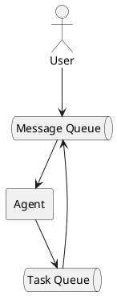

# Асинхронный пользовательский ввод

Текущее поведение кода ограничивает пользовательский ввод новых предложений, 
пока Ai-агент или Tools находится в процессе. Цикл обработки AI-агент + Tools называется `Turn-Loop`.
Будем использовать этот термин, чтобы обозначить функцию, которая обрабатывает один пользовательский ввод и возвращает результат.
В коде так же изменим метод handler на `turnLoop`.

Как можно догадатся, чтобы достичь асинхронного поведения, нужно запустить логику `turnLoop` в отдельной корутине,
тогда она не будет блокировать пользовательский ввод. Но что делать с пользовательским вводом?!

Если бы мы хотели построить современный агентский клиент, 
нам бы захотелось обеспечить настоящую и полную асинхронность.
Для этого нужно было бы каждый компонент вынести в отдельную корутину, 
а взаимодействие вынести в каналы:



Данная схема максимально гибкая, однако выбранный API AI-агентов требует, 
чтобы мы вернули результат всех Tools синхронно. Здесь стоит сделать небольшое отступление.
Современные `API`, например такие, как в `Anthropic` позволяют работать с агентом по модели `EventDriven` (SSE протокол) и идеально 
подходят для интерактивных приложений. Но для Claw-типичного приложения `EventDriven` API избыточен.

Начнём рефакторинг с трансформации кода главного цикла. Выделим его тело в отдельный метод `startTurn`, 
который будет запускать корутину, и изменим главный цикл:

```php
$deferredMessages = [];
$currentTurn = null;

while (($message = $this->conversation->receive()) !== null) {
    $deferredMessages[] = $message;

    if ($currentTurn === null || $currentTurn->isCompleted()) {
        $currentTurn = spawn($this->startTurn(...), $deferredMessages);
        $deferredMessages = [];
    }
}
```

Идея в том, что главный цикл крутится независимо от работы `Turn-Loop`, 
и накапливает все сообщения пользователя в массив. Как только `Turn-Loop` завершает работу, 
мы запускаем новый `Turn-Loop` с накопленными сообщениями. Одновременно только один `Turn-Loop` может работать, 
вместе с тем код обработки входящих сообщений не заблокирован. 

## Отмена

Параллельная обработка пользовательского ввода открывает возможность для отмены `Turn-Loop`.
В `TrueAsync` поддерживает возможность отменить любую корутину через метод `Coroutine::cancel()`.
