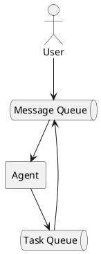

# Асинхронный пользовательский ввод

Текущее поведение кода ограничивает пользовательский ввод новых предложений, 
пока Ai-агент или Tools находится в процессе. Цикл обработки AI-агент + Tools называется `Turn-Loop`.
Будем использовать этот термин, чтобы обозначить функцию, которая обрабатывает один пользовательский ввод и возвращает результат.
В коде так же изменим метод handler на `turnLoop`.

Как можно догадатся, чтобы достичь асинхронного поведения, нужно запустить логику `turnLoop` в отдельной корутине,
тогда она не будет блокировать пользовательский ввод. Но что делать с пользовательским вводом?!

Если бы мы хотели построить современный агентский клиент, 
нам бы захотелось обеспечить настоящую и полную асинхронность.
Для этого нужно было бы каждый компонент вынести в отдельную корутину, 
а взаимодействие вынести в каналы:



Данная схема максимально гибкая, однако выбранный API AI-агентов требует, 
чтобы мы вернули результат всех Tools синхронно. Здесь стоит сделать небольшое отступление.
Современные `API`, например такие, как в `Anthropic` позволяют работать с агентом по модели `EventDriven` (SSE протокол) и идеально 
подходят для интерактивных приложений. Но для Claw-типичного приложения `EventDriven` API избыточен.

Начнём рефакторинг с трансформации кода главного цикла. Выделим его тело в отдельный метод `startTurn`, 
который будет запускать корутину, и изменим главный цикл:

```php
$deferredMessages = [];
$currentTurn = null;

while (($message = $this->conversation->receive()) !== null) {
    $deferredMessages[] = $message;

    if ($currentTurn === null || $currentTurn->isCompleted()) {
        $currentTurn = spawn($this->startTurn(...), $deferredMessages);
        $deferredMessages = [];
    }
}
```

Идея в том, что главный цикл крутится независимо от работы `Turn-Loop`, 
и накапливает все сообщения пользователя в массив. Как только `Turn-Loop` завершает работу, 
мы запускаем новый `Turn-Loop` с накопленными сообщениями. Одновременно только один `Turn-Loop` может работать, 
вместе с тем код обработки входящих сообщений не заблокирован. 

## Отмена

Параллельная обработка пользовательского ввода открывает возможность для отмены `Turn-Loop`.
`TrueAsync` поддерживает возможность отменить любую корутину через метод `Coroutine::cancel()`:

```php
    if($message === '/stop' && $currentTurn !== null && $currentTurn->isRunning()) {
        $currentTurn->cancel(new \Async\AsyncCancellation('User canceled'));
    }
```

Исключение `AsyncCancellation` может содержать причину отмены, и будет передано в точку последней приостановки корутины.
Здесь необходимо более серьёзно поговорить о том, как именно работают корутины в `TrueAsync` и как они передают управление.

## Корутины TrueAsync и suspend

Корутины в `TrueAsync` всегда передают управление кооперативно. У корутины нельзя забрать управление,
как например это происходит в `Go` или прервать её в каком угодно месте.
Когда корутина хочет передать управление она зовёт `suspend()` функцию. С этого момента корутина не знает,
в какой момент времени к ней вернётся управление. Она так же не знает и не может знать, куда именно управление будет передано.

```php
use function Async\spawn;
use function Async\suspend;

function a(): void
{
    echo "a: before suspend\n";
    suspend();
    echo "a: after suspend\n";
}

function b(): void
{
    echo "b: before suspend\n";
    suspend();
    echo "b: after suspend\n";
}

spawn(a(...));
spawn(b(...));
```

Будет выведено (при условии, что никаких других корутин нет):
```bash
a: before suspend
b: before suspend
a: after suspend
b: after suspend
```

Функция `suspend` передаёт управление в другую корутины, а как результат может выбросить исключение. 
Именно так и работает механизм отмены:


```php
use function Async\spawn;
use function Async\suspend;
use Async\AsyncCancellation;
use Async\Coroutine;

function a(): void
{
    echo "a: before suspend\n";
    suspend();
    echo "a: never executed\n";
}

function b(Coroutine $coroutine): void
{
    echo "b: before suspend\n";
    $coroutine->cancel();
    suspend();
    echo "b: after suspend\n";
}

$coroutine = spawn(a(...));
spawn(b(...), $coroutine);
```

На этот раз вывод будет таким:
```bash
a: before suspend
b: before suspend
b: after suspend
```

Код `echo "a: never executed\n";` никогда не получит управление. Произошло следующее:
1. Функция `suspend()` выбросила исключение `AsyncCancellation`
2. Исключение было перехвачено в точке завершения корутины `a()`.

И вот важный факт: функция `suspend()` чаще всего вызыается не из PHP-кода явно, а из других функций ввода вывода!
Иначе говоря:
```php
function a(): void
{
    echo "before suspend\n";
    file_get_contents('http://example.com'); 
    echo "after\n";
}
```

Функция стандартной библиотеки PHP `file_get_contents` под копотом сама вызовит `suspend`, 
и в этот момент управление будет передано другой корутине. Что же произойдёт, если во время операции `file_get_contents`
инициировать отмену? Операция будет прервана. `file_get_contents` увидит исключение отмены, обработает его и вернёт `false`.

Данный подход позволяет добавить конкурентное исполнение в каждую библиотечную функцию ввода вывода с минимальными 
изменениями со стороны PHP-разработчика. В большинстве случаев не придётся специально модифицировать код, 
чтобы использовать отмену или асинхронность. Однако важно понимать, в каких точках происходит переключение 
и как именно функции библиотеки реагируют на него.